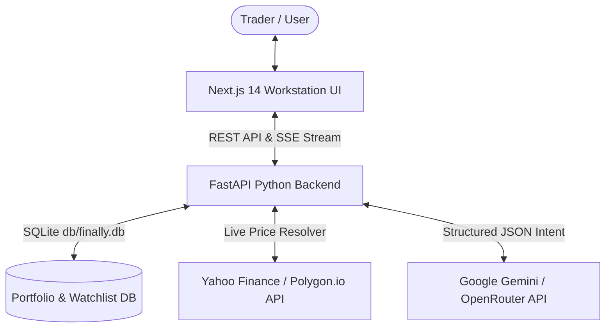

# 🚀 Finagy (FinAlly) — AI-Powered Trading Workstation

[](https://antigravity.google)
[](https://gemini.google.com)
[](https://github.com/ed-donner/finally)
[](LICENSE)

**Finagy** is an AI-powered trading workstation and real-time market dashboard. Based on **Ed Donner's FinAlly Capstone Project**, this workstation was built and ported natively within **Google Antigravity** using **Google Gemini LLMs**, emulating multi-agent team workflows through specialized AI subagents.

---

## 🌟 Overview

Finagy provides a Bloomberg-inspired trading terminal where traders can monitor live market prices, analyze portfolio allocations, track historical PnL, and interact with an **AI Copilot** capable of executing trades and managing watchlists via natural language.

### Key Highlights:
* **Google Antigravity Agent Build**: Designed and constructed using Antigravity's native subagent orchestration across backend, frontend, market data, and DevOps roles.
* **Powered by Google Gemini LLMs**: Uses Gemini models to understand complex financial intents, execute structured market orders (`buy`/`sell`), and modify watchlists automatically.
* **Dynamic Real-World Market Data Engine**: Replaced static price lists with a live market data resolver (`fetch_real_market_price`). Adding ANY ticker (such as **IBIT**, **NVDA**, **TSLA**, **AAPL**, **SPY**) automatically resolves its **actual real-world market quote** via live APIs and streams real-time Brownian motion tick updates.
* **Full Workstation State Sync**: Modern Next.js 14 frontend connects via Server-Sent Events (SSE) and custom workstation event dispatchers (`refresh-workstation`) so trade executions instantly update portfolio heatmaps, cash balances, and positions without page reloads.

---

## 🏗️ Architecture & Technology Stack



* **Frontend**: Next.js 14 (TypeScript), Tailwind CSS, Recharts, Lucide Icons, static export (`output: 'export'`).
* **Backend**: FastAPI (Python 3.12), SQLite, SSE Starlette streaming, Pydantic, `uv` package manager.
* **Containerization**: Single-container Docker image serving pre-built static frontend assets and FastAPI backend on port `8000`.

---

## 🚀 Quick Start (Windows)

### 1. Launch the Workstation Service
Run the automated PowerShell launch script:
```powershell
.\scripts\start_windows.ps1
```
This script will build the Docker container in the background and output the access URL:
```text
[SUCCESS] FinAlly service is up and running!
[URL] Access the workstation at: http://localhost:8000
```

### 2. Access the Workstation
Open your browser and navigate to:
👉 **[http://localhost:8000/](http://localhost:8000/)**

### 3. Stop the Service
When finished, stop the service with:
```powershell
.\scripts\stop_windows.ps1
```

---

## 🤖 AI Assistant Commands

You can prompt the AI Assistant in natural language:

* *"Please buy 10 shares of AAPL"*
* *"Add IBIT to my watchlist"*
* *"What is my current portfolio total value and top holding?"*
* *"Sell 5 shares of TSLA"*

---

## 📂 Project Structure

```text
finagy/
├── backend/                  # FastAPI Backend & Market Data Engine
│   ├── db/                   # SQLite database & lazy initialization
│   ├── llm/                  # Gemini/OpenRouter LLM service & intent parser
│   ├── main.py               # FastAPI application & SSE price streamer
│   ├── market_data.py        # Live market data resolver & GBM simulator
│   └── tests/                # Pytest suite
├── frontend/                 # Next.js 14 Workstation UI
│   ├── src/app/              # Next.js pages & styling
│   ├── src/components/       # Terminal components (Watchlist, Portfolio, Heatmap, AI Chat)
│   └── src/hooks/            # Real-time SSE price hook
├── scripts/                  # Windows launch & stop PowerShell scripts
├── planning/                 # Architectural specifications (PLAN.md)
├── Dockerfile                # Single-container production build
└── .dockerignore             # Context optimization file
```

---

## 🔮 Roadmap (V2)

* **Schwab Developer API Integration**: OAuth2 authentication and live Schwab market data streaming.
* **Functional Options Desk**: Options chain viewer, Greeks calculation, and automated options strategy execution.

---

## 🙏 Acknowledgments & Credits

Special thanks to **Ed Donner** for creating the original **FinAlly** Capstone project and course curriculum on Agentic AI Coding!

* Original FinAlly Repository: [ed-donner/finally](https://github.com/ed-donner/finally)
